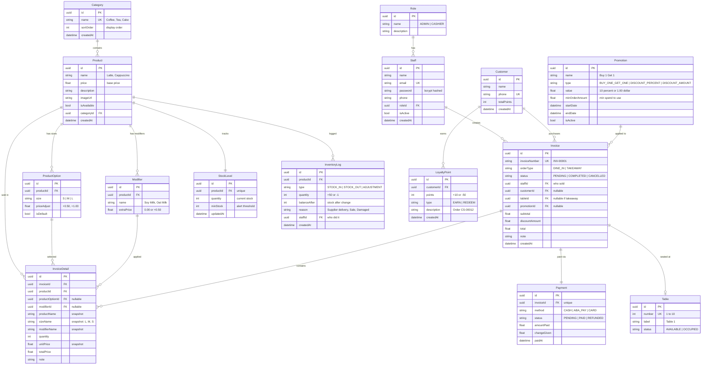

# ☕ Coffee Shop POS — Database Design Review

## Your Design Score

| Module | Status | Notes |
|--------|--------|-------|
| Product Management | ✅ Great | Good structure. Added some missing fields below |
| Sale & Invoice | ✅ Great | Solid. Renamed to match real-world POS conventions |
| Customer & Promotion | ⚠️ Good idea | Needs relationship links between promotion → invoice |
| User & Staff | ✅ Great | Added permission separation |
| Stock Management | ✅ Great | Smart to include inventory_log for history |

**Overall: 8/10** — Very strong for a mini POS! Below are my recommendations to make it production-ready.

---

## Complete ER Diagram (Your Design + My Improvements)

---

## Detailed Review by Module

### 1. Product Management ✅

| Table | Your Design | My Additions |
|-------|------------|--------------|
| `Product` | name ✅ | + `description`, `imageUrl`, `isAvailable`, `price` (base price) |
| `Category` | category ✅ | + `sortOrder` (control display order) |
| `ProductOption` | size L/M/S ✅ | + `priceAdjust` (size affects price), `isDefault` |
| `Modifier` | change milk ✅ | + `extraPrice` (oat milk costs more) |

> [!TIP]
> **Why `isAvailable`?** Instead of deleting a product, set `isAvailable = false`. This way old invoices still reference it, but it won't show on the POS screen.

### 2. Sale & Invoice Management ✅

| Table | Your Design | My Additions |
|-------|------------|--------------|
| `Invoice` (your invoice_header) | info ✅ | + `invoiceNumber` (auto: INV-00001), `staffId` (who sold), `tableId`, `promotionId` |
| `InvoiceDetail` (your invoice_detail) | product, qty, price ✅ | + `productName` snapshot, `sizeName` snapshot, `modifierName` snapshot |
| `Payment` | status, cash/aba ✅ | + `status` (PENDING/PAID/REFUNDED), `changeGiven`, `amountPaid` |

> [!IMPORTANT]
> **Snapshot Fields**: `InvoiceDetail` saves `productName`, `unitPrice`, `sizeName` at order time. If you change a Latte from $3 to $3.50 next month, old invoices still show $3.

### 3. Customer & Promotion Management ⚠️

| Table | Your Design | My Improvements |
|-------|------------|-----------------|
| `Customer` | name, phone ✅ | + `totalPoints` (cached summary) |
| `LoyaltyPoint` | points ✅ | Changed to **log-based** design: each row is +10 EARN or -50 REDEEM |
| `Promotion` | buy 1 get 1 ✅ | + `type` enum, `value`, `startDate/endDate`, `minOrderAmount` |

> [!WARNING]
> **Missing link in your design**: `Promotion` needs to connect to `Invoice` so you know which invoice used which promotion. I added `Invoice.promotionId` to solve this.

> [!TIP]
> **Loyalty Points as Log**: Instead of just storing a number, log each point transaction. This way you have full history: "Earned 10 pts from Order INV-00012" and "Redeemed 50 pts".

### 4. User & Staff Management ✅

| Table | Your Design | My Improvements |
|-------|------------|-----------------|
| `Staff` | employee info ✅ | + `email` (for login), `password` (hashed), `isActive`, `phone` |
| `Role` | admin, cashier ✅ | Made it a **separate table** so you can add roles later without code changes |

**Role Permissions:**

| Permission | ADMIN | CASHIER |
|------------|:-----:|:-------:|
| Create orders | ✅ | ✅ |
| View own sales | ✅ | ✅ |
| View all reports | ✅ | ❌ |
| Manage menu | ✅ | ❌ |
| Manage staff | ✅ | ❌ |
| Manage stock | ✅ | ❌ |
| Manage promotions | ✅ | ❌ |

### 5. Stock Management ✅

| Table | Your Design | My Improvements |
|-------|------------|-----------------|
| `StockLevel` (your stock_level) | current stock ✅ | + `minStock` (alert when low) |
| `InventoryLog` (your inventory_log) | in/out history ✅ | + `balanceAfter` (stock after each change), `staffId` (who did it), `reason` |

> [!TIP]
> **Auto stock-out**: When a sale is completed, the system should automatically create an `STOCK_OUT` entry in `InventoryLog` and decrease `StockLevel.quantity`.

---

## Summary: What You Had vs What I Added

| Your Original Table | Final Table Name | Key Fields Added |
|---------------------|-----------------|------------------|
| product | `Product` | description, imageUrl, isAvailable |
| category | `Category` | sortOrder |
| product_option | `ProductOption` | priceAdjust, isDefault |
| modifier | `Modifier` | extraPrice |
| invoice_header | `Invoice` | invoiceNumber, staffId, tableId, promotionId, orderType |
| invoice_detail | `InvoiceDetail` | productName/sizeName/modifierName snapshots |
| payment | `Payment` | status enum, amountPaid, changeGiven |
| customer | `Customer` | totalPoints |
| loyalty_point | `LoyaltyPoint` | type (EARN/REDEEM), description (log-based) |
| promotion | `Promotion` | type enum, value, date range, minOrderAmount |
| staff | `Staff` | email, password (hashed), isActive |
| role | `Role` | separate table instead of enum |
| stock_level | `StockLevel` | minStock threshold |
| inventory_log | `InventoryLog` | balanceAfter, staffId, reason |
| *(missing)* | `Table` | **NEW** — your requirement mentions 10 tables! |
